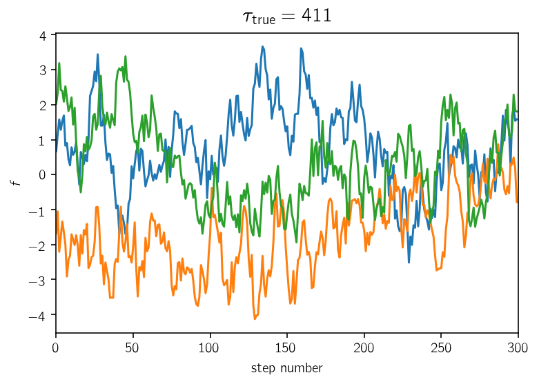
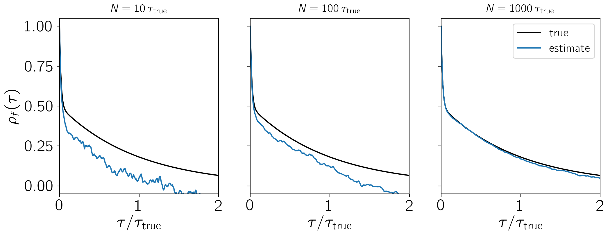
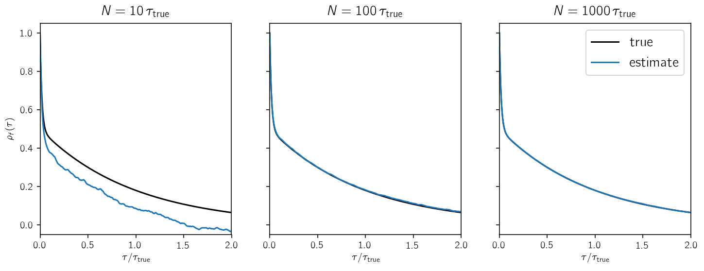
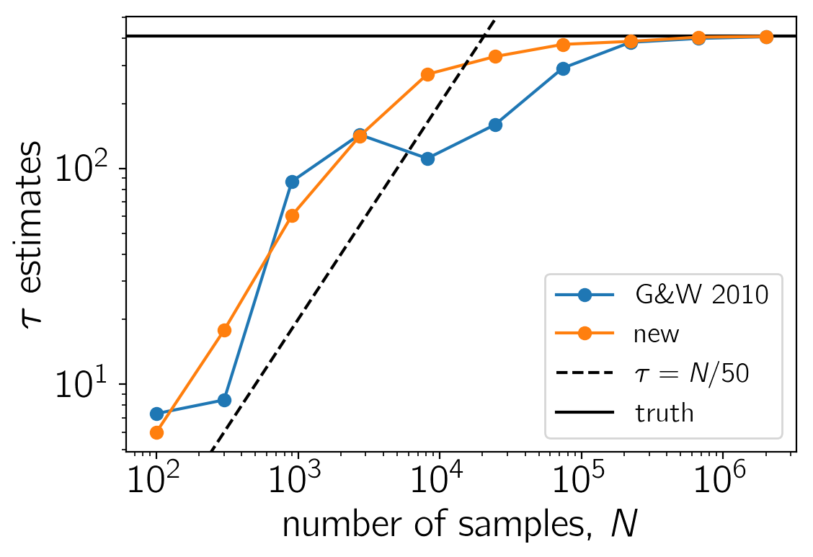
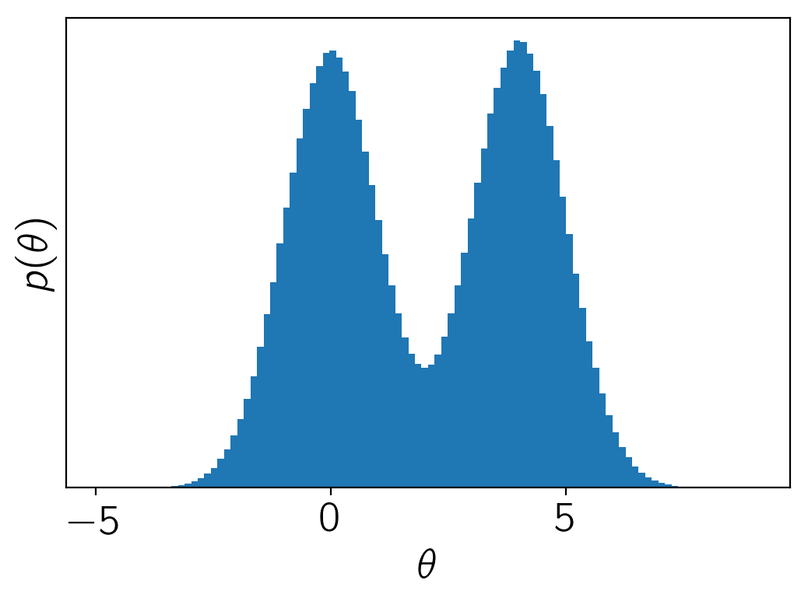
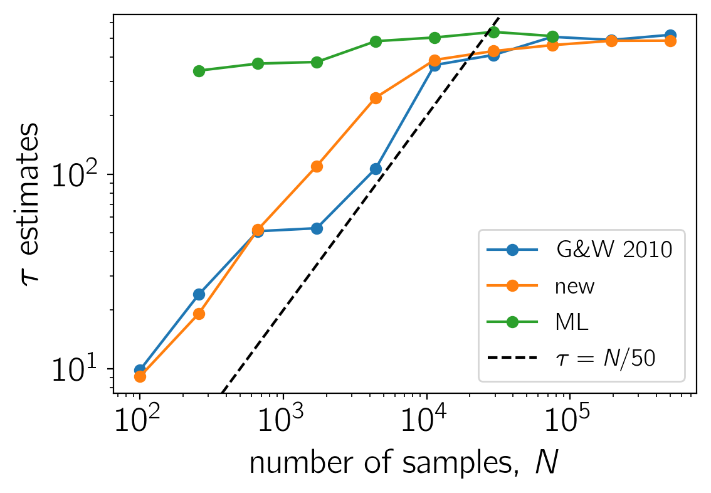

.. module:: emcee

**Note:** This tutorial was generated from an IPython notebook that can be
downloaded `here <../../_static/notebooks/autocorr.ipynb>`_.

.. _autocorr:

Autocorrelation analysis & convergence
======================================

In this tutorial, we will discuss a method for convincing yourself that
your chains are sufficiently converged. This can be a difficult subject
to discuss because it isn’t formally possible to guarantee convergence
for any but the simplest models, and therefore any argument that you
make will be circular and heuristic. However, some discussion of
autocorrelation analysis is (or should be!) a necessary part of any
publication using MCMC.

With emcee, we follow `Goodman & Weare
(2010) <http://msp.berkeley.edu/camcos/2010/5-1/p04.xhtml>`__ and
recommend using the *integrated autocorrelation time* to quantify the
effects of sampling error on your results. The basic idea is that the
samples in your chain are not independent and you must estimate the
effective number of independent samples. There are other convergence
diagnostics like the `Gelman–Rubin
statistic <http://digitalassets.lib.berkeley.edu/sdtr/ucb/text/305.pdf>`__
(*Note: you should not compute the G–R statistic using multiple chains
in the same emcee ensemble because the chains are not independent!*)
but, since the integrated autocorrelation time directly quantifies the
Monte Carlo error (and hence the efficiency of the sampler) on any
integrals computed using the MCMC results, it is the natural quantity of
interest when judging the robustness of an MCMC analysis.

Monte Carlo error
-----------------

The goal of every MCMC analysis is to evaluate integrals of the form

.. math::

   \mathrm{E}_{p(\theta)}[f(\theta)] = \int f(\theta)\,p(\theta)\,\mathrm{d}\theta \quad.

If you had some way of generating :math:`N` samples :math:`\theta^{(n)}`
from the probability density :math:`p(\theta)`, then you could
approximate this integral as

.. math::

   \mathrm{E}_{p(\theta)}[f(\theta)] \approx \frac{1}{N} \sum_{n=1}^N f(\theta^{(n)})

where the sum is over the samples from :math:`p(\theta)`. If these
samples are independent, then the sampling variance on this estimator is

.. math::

   \sigma^2 = \frac{1}{N}\,\mathrm{Var}_{p(\theta)}[f(\theta)]

and the error decreses as :math:`1/\sqrt{N}` as you generate more
samples. In the case of MCMC, the samples are not independent and the
error is actually given by

.. math::

   \sigma^2 = \frac{\tau_f}{N}\,\mathrm{Var}_{p(\theta)}[f(\theta)]

where :math:`\tau_f` is the *integrated autocorrelation time* for the
chain :math:`f(\theta^{(n)})`. In other words, :math:`N/\tau_f` is the
effective number of samples and :math:`\tau_f` is the number of steps
that are needed before the chain “forgets” where it started. This means
that, if you can estimate :math:`\tau_f`, then you can estimate the
number of samples that you need to generate to reduce the relative error
on your target integral to (say) a few percent.

**Note:** It is important to remember that :math:`\tau_f` depends on the
specific function :math:`f(\theta)`. This means that there isn’t just
*one* integrated autocorrelation time for a given Markov chain. Instead,
you must compute a different :math:`\tau_f` for any integral you
estimate using the samples.

Computing autocorrelation times
-------------------------------

There is a great discussion of methods for autocorrelation estimation in
`a set of lecture notes by Alan
Sokal <https://pdfs.semanticscholar.org/0bfe/9e3db30605fe2d4d26e1a288a5e2997e7225.pdf>`__
and the interested reader should take a look at that for a more formal
discussion, but I’ll include a summary of some of the relevant points
here. The integrated autocorrelation time is defined as

.. math::

   \tau_f = \sum_{\tau=-\infty}^\infty \rho_f(\tau)

where :math:`\rho_f(\tau)` is the normalized autocorrelation function of
the stochastic process that generated the chain for :math:`f`. You can
estimate :math:`\rho_f(\tau)` using a finite chain
:math:`\{f_n\}_{n=1}^N` as

.. math::

   \hat{\rho}_f(\tau) = \hat{c}_f(\tau) / \hat{c}_f(0)

where

.. math::

   \hat{c}_f(\tau) = \frac{1}{N - \tau} \sum_{n=1}^{N-\tau} (f_n - \mu_f)\,(f_{n+\tau}-\mu_f)

and

.. math::

   \mu_f = \frac{1}{N}\sum_{n=1}^N f_n \quad.

(Note: In practice, it is actually more computationally efficient to
compute :math:`\hat{c}_f(\tau)` using a fast Fourier transform than
summing it directly.)

Now, you might expect that you can estimate :math:`\tau_f` using this
estimator for :math:`\rho_f(\tau)` as

.. math::

   \hat{\tau}_f \stackrel{?}{=} \sum_{\tau=-N}^{N} \hat{\rho}_f(\tau) = 1 + 2\,\sum_{\tau=1}^N \hat{\rho}_f(\tau)

but this isn’t actually a very good idea. At longer lags,
:math:`\hat{\rho}_f(\tau)` starts to contain more noise than signal and
summing all the way out to :math:`N` will result in a very noisy
estimate of :math:`\tau_f`. Instead, we want to estimate :math:`\tau_f`
as

.. math::

   \hat{\tau}_f (M) = 1 + 2\,\sum_{\tau=1}^M \hat{\rho}_f(\tau)

for some :math:`M \ll N`. As discussed by Sokal in the notes linked
above, the introduction of :math:`M` decreases the variance of the
estimator at the cost of some added bias and he suggests choosing the
smallest value of :math:`M` where :math:`M \ge C\,\hat{\tau}_f (M)` for
a constant :math:`C \sim 5`. Sokal says that he finds this procedure to
work well for chains longer than :math:`1000\,\tau_f`, but the situation
is a bit better with emcee because we can use the parallel chains to
reduce the variance and we’ve found that chains longer than about
:math:`50\,\tau` are often sufficient.

A toy problem
-------------

To demonstrate this method, we’ll start by generating a set of “chains”
from a process with known autocorrelation structure. To generate a large
enough dataset, we’ll use `celerite <http://celerite.readthedocs.io>`__:

.. code:: python

    import numpy as np
    import matplotlib.pyplot as plt
    
    np.random.seed(1234)
    
    # Build the celerite model:
    import celerite
    from celerite import terms
    kernel = terms.RealTerm(log_a=0.0, log_c=-6.0)
    kernel += terms.RealTerm(log_a=0.0, log_c=-2.0)
    
    # The true autocorrelation time can be calculated analytically:
    true_tau = sum(2*np.exp(t.log_a-t.log_c) for t in kernel.terms)
    true_tau /= sum(np.exp(t.log_a) for t in kernel.terms)
    true_tau
    
    # Simulate a set of chains:
    gp = celerite.GP(kernel)
    t = np.arange(2000000)
    gp.compute(t)
    y = gp.sample(size=32)
    
    # Let's plot a little segment with a few samples:
    plt.plot(y[:3, :300].T)
    plt.xlim(0, 300)
    plt.xlabel("step number")
    plt.ylabel("$f$")
    plt.title("$\\tau_\mathrm{{true}} = {0:.0f}$".format(true_tau), fontsize=14);

Now we’ll estimate the empirical autocorrelation function for each of
these parallel chains and compare this to the true function.

.. code:: python

    def next_pow_two(n):
        i = 1
        while i < n:
            i = i << 1
        return i
    
    def autocorr_func_1d(x, norm=True):
        x = np.atleast_1d(x)
        if len(x.shape) != 1:
            raise ValueError("invalid dimensions for 1D autocorrelation function")
        n = next_pow_two(len(x))
    
        # Compute the FFT and then (from that) the auto-correlation function
        f = np.fft.fft(x - np.mean(x), n=2*n)
        acf = np.fft.ifft(f * np.conjugate(f))[:len(x)].real
        acf /= 4*n
        
        # Optionally normalize
        if norm:
            acf /= acf[0]
    
        return acf
    
    # Make plots of ACF estimate for a few different chain lengths
    window = int(2*true_tau)
    tau = np.arange(window+1)
    f0 = kernel.get_value(tau) / kernel.get_value(0.0)
    
    # Loop over chain lengths:
    fig, axes = plt.subplots(1, 3, figsize=(12, 4), sharex=True, sharey=True)
    for n, ax in zip([10, 100, 1000], axes):
        nn = int(true_tau * n)
        ax.plot(tau / true_tau, f0, "k", label="true")
        ax.plot(tau / true_tau, autocorr_func_1d(y[0, :nn])[:window+1], label="estimate")
        ax.set_title(r"$N = {0}\,\tau_\mathrm{{true}}$".format(n), fontsize=14)
        ax.set_xlabel(r"$\tau / \tau_\mathrm{true}$")
    
    axes[0].set_ylabel(r"$\rho_f(\tau)$")
    axes[-1].set_xlim(0, window / true_tau)
    axes[-1].set_ylim(-0.05, 1.05)
    axes[-1].legend(fontsize=14);

This figure shows how the empirical estimate of the normalized
autocorrelation function changes as more samples are generated. In each
panel, the true autocorrelation function is shown as a black curve and
the empricial estimator is shown as a blue line.

Instead of estimating the autocorrelation function using a single chain,
we can assume that each chain is sampled from the same stochastic
process and average the estimate over ensemble members to reduce the
variance. It turns out that we’ll actually do this averaging later in
the process below, but it can be useful to show the mean autocorrelation
function for visualization purposes.

.. code:: python

    fig, axes = plt.subplots(1, 3, figsize=(12, 4), sharex=True, sharey=True)
    for n, ax in zip([10, 100, 1000], axes):
        nn = int(true_tau * n)
        ax.plot(tau / true_tau, f0, "k", label="true")
        f = np.mean([autocorr_func_1d(y[i, :nn], norm=False)[:window+1]
                     for i in range(len(y))], axis=0)
        f /= f[0]
        ax.plot(tau / true_tau, f, label="estimate")
        ax.set_title(r"$N = {0}\,\tau_\mathrm{{true}}$".format(n), fontsize=14)
        ax.set_xlabel(r"$\tau / \tau_\mathrm{true}$")
    
    axes[0].set_ylabel(r"$\rho_f(\tau)$")
    axes[-1].set_xlim(0, window / true_tau)
    axes[-1].set_ylim(-0.05, 1.05)
    axes[-1].legend(fontsize=14);

Now let’s estimate the autocorrelation time using these estimated
autocorrelation functions. Goodman & Weare (2010) suggested averaging
the ensemble over walkers and computing the autocorrelation function of
the mean chain to lower the variance of the estimator and that was what
was originally implemented in emcee. Since then, @fardal on GitHub
`suggested that other estimators might have lower
variance <https://github.com/dfm/emcee/issues/209>`__. This is
absolutely correct and, instead of the Goodman & Weare method, we now
recommend computing the autocorrelation time for each walker (it’s
actually possible to still use the ensemble to choose the appropriate
window) and then average these estimates.

Here is an implementation of each of these methods and a plot showing
the convergence as a function of the chain length:

.. code:: python

    # Automated windowing procedure following Sokal (1989)
    def auto_window(taus, c):
        m = np.arange(len(taus)) < c * taus
        if np.any(m):
            return np.argmin(m)
        return len(taus) - 1
    
    # Following the suggestion from Goodman & Weare (2010)
    def autocorr_gw2010(y, c=5.0):
        f = autocorr_func_1d(np.mean(y, axis=0))
        taus = 2.0*np.cumsum(f)-1.0
        window = auto_window(taus, c)
        return taus[window]
    
    def autocorr_new(y, c=5.0):
        f = np.zeros(y.shape[1])
        for yy in y:
            f += autocorr_func_1d(yy)
        f /= len(y)
        taus = 2.0*np.cumsum(f)-1.0
        window = auto_window(taus, c)
        return taus[window]
    
    # Compute the estimators for a few different chain lengths
    N = np.exp(np.linspace(np.log(100), np.log(y.shape[1]), 10)).astype(int)
    gw2010 = np.empty(len(N))
    new = np.empty(len(N))
    for i, n in enumerate(N):
        gw2010[i] = autocorr_gw2010(y[:, :n])
        new[i] = autocorr_new(y[:, :n])
    
    # Plot the comparisons
    plt.loglog(N, gw2010, "o-", label="G\&W 2010")
    plt.loglog(N, new, "o-", label="new")
    ylim = plt.gca().get_ylim()
    plt.plot(N, N / 50.0, "--k", label=r"$\tau = N/50$")
    plt.axhline(true_tau, color="k", label="truth", zorder=-100)
    plt.ylim(ylim)
    plt.xlabel("number of samples, $N$")
    plt.ylabel(r"$\tau$ estimates")
    plt.legend(fontsize=14);

In this figure, the true autocorrelation time is shown as a horizontal
line and it should be clear that both estimators give outrageous results
for the short chains. It should also be clear that the new algorithm has
lower variance than the original method based on Goodman & Weare. In
fact, even for moderately long chains, the old method can give
dangerously over-confident estimates. For comparison, we have also
plotted the :math:`\tau = N/50` line to show that, once the estimate
crosses that line, The estimates are starting to get more reasonable.
This suggests that you probably shouldn’t trust any estimate of
:math:`\tau` unless you have more than :math:`F\times\tau` samples for
some :math:`F \ge 50`. Larger values of :math:`F` will be more
conservative, but they will also (obviously) require longer chains.

A more realistic example
------------------------

Now, let’s run an actual Markov chain and test these methods using those
samples. So that the sampling isn’t completely trivial, we’ll sample a
multimodal density in three dimensions.

.. code:: python

    import emcee
    
    def log_prob(p):
        return np.logaddexp(-0.5*np.sum(p**2), -0.5*np.sum((p-4.0)**2))
    
    sampler = emcee.EnsembleSampler(32, 3, log_prob)
    sampler.run_mcmc(np.concatenate((np.random.randn(16, 3),
                                     4.0+np.random.randn(16, 3)), axis=0),
                     500000, progress=True);

.. parsed-literal::

    /Users/dforeman/anaconda/lib/python3.6/site-packages/h5py/__init__.py:36: FutureWarning: Conversion of the second argument of issubdtype from `float` to `np.floating` is deprecated. In future, it will be treated as `np.float64 == np.dtype(float).type`.
      from ._conv import register_converters as _register_converters
    100%|██████████| 500000/500000 [06:23<00:00, 1302.86it/s]

Here’s the marginalized density in the first dimension.

.. code:: python

    chain = sampler.get_chain()[:, :, 0].T
    
    plt.hist(chain.flatten(), 100)
    plt.gca().set_yticks([])
    plt.xlabel(r"$\theta$")
    plt.ylabel(r"$p(\theta)$");

And here’s the comparison plot showing how the autocorrelation time
estimates converge with longer chains.

.. code:: python

    # Compute the estimators for a few different chain lengths
    N = np.exp(np.linspace(np.log(100), np.log(chain.shape[1]), 10)).astype(int)
    gw2010 = np.empty(len(N))
    new = np.empty(len(N))
    for i, n in enumerate(N):
        gw2010[i] = autocorr_gw2010(chain[:, :n])
        new[i] = autocorr_new(chain[:, :n])
    
    # Plot the comparisons
    plt.loglog(N, gw2010, "o-", label="G\&W 2010")
    plt.loglog(N, new, "o-", label="new")
    ylim = plt.gca().get_ylim()
    plt.plot(N, N / 50.0, "--k", label=r"$\tau = N/50$")
    plt.ylim(ylim)
    plt.xlabel("number of samples, $N$")
    plt.ylabel(r"$\tau$ estimates")
    plt.legend(fontsize=14);

.. image:: autocorr_files/autocorr_18_0.png

As before, the short chains give absurd estimates of :math:`\tau`, but
the new method converges faster and with lower variance than the old
method. The :math:`\tau = N/50` line is also included as above as an
indication of where we might start trusting the estimates.

What about shorter chains?
--------------------------

Sometimes it just might not be possible to run chains that are long
enough to get a reliable estimate of :math:`\tau` using the methods
described above. In these cases, you might be able to get an estimate
using parametric models for the autocorrelation. One example would be to
fit an `autoregressive
model <https://en.wikipedia.org/wiki/Autoregressive_model>`__ to the
chain and using that to estimate the autocorrelation time.

As an example, we’ll use `celerite <http://celerite.readthdocs.io>`__ to
fit for the maximum likelihood autocorrelation function and then compute
an estimate of :math:`\tau` based on that model. The celerite model that
we’re using is equivalent to a second-order ARMA model and it appears to
be a good choice for this example, but we’re not going to promise
anything here about the general applicability and we caution care
whenever estimating autocorrelation times using short chains.

.. code:: python

    from scipy.optimize import minimize
    
    def autocorr_ml(y, thin=1, c=5.0):
        # Compute the initial estimate of tau using the standard method
        init = autocorr_new(y, c=c)
        z = y[:, ::thin]
        N = z.shape[1]
        
        # Build the GP model
        tau = max(1.0, init/thin)
        kernel = terms.RealTerm(np.log(0.9*np.var(z)), -np.log(tau),
                            bounds=[(-5.0, 5.0), (-np.log(N), 0.0)])
        kernel += terms.RealTerm(np.log(0.1*np.var(z)), -np.log(0.5*tau),
                                bounds=[(-5.0, 5.0), (-np.log(N), 0.0)])
        gp = celerite.GP(kernel, mean=np.mean(z))
        gp.compute(np.arange(z.shape[1]))
    
        # Define the objective
        def nll(p):
            # Update the GP model
            gp.set_parameter_vector(p)
            
            # Loop over the chains and compute likelihoods
            v, g = zip(*(
                gp.grad_log_likelihood(z0, quiet=True)
                for z0 in z
            ))
            
            # Combine the datasets
            return -np.sum(v), -np.sum(g, axis=0)
    
        # Optimize the model
        p0 = gp.get_parameter_vector()
        bounds = gp.get_parameter_bounds()
        soln = minimize(nll, p0, jac=True, bounds=bounds)
        gp.set_parameter_vector(soln.x)
        
        # Compute the maximum likelihood tau
        a, c = kernel.coefficients[:2]
        tau = thin * 2*np.sum(a / c) / np.sum(a)
        return tau
    
    # Calculate the estimate for a set of different chain lengths
    ml = np.empty(len(N))
    ml[:] = np.nan
    for j, n in enumerate(N[1:8]):
        i = j+1
        thin = max(1, int(0.05*new[i]))
        ml[i] = autocorr_ml(chain[:, :n], thin=thin)

.. code:: python

    # Plot the comparisons
    plt.loglog(N, gw2010, "o-", label="G\&W 2010")
    plt.loglog(N, new, "o-", label="new")
    plt.loglog(N, ml, "o-", label="ML")
    ylim = plt.gca().get_ylim()
    plt.plot(N, N / 50.0, "--k", label=r"$\tau = N/50$")
    plt.ylim(ylim)
    plt.xlabel("number of samples, $N$")
    plt.ylabel(r"$\tau$ estimates")
    plt.legend(fontsize=14);

.. parsed-literal::

    /Users/dforeman/anaconda/lib/python3.6/site-packages/matplotlib/scale.py:114: RuntimeWarning: invalid value encountered in less_equal
      out[a <= 0] = -1000

This figure is the same as the previous one, but we’ve added the maximum
likelihood estimates for :math:`\tau` in green. In this case, this
estimate seems to be robust even for very short chains with
:math:`N \sim \tau`.

