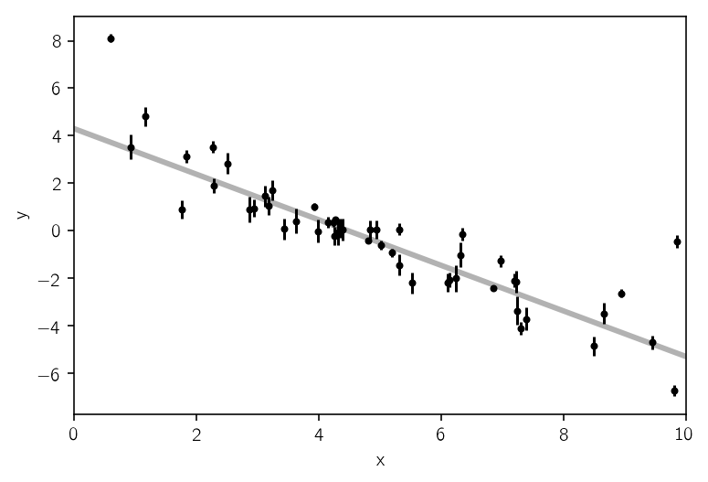
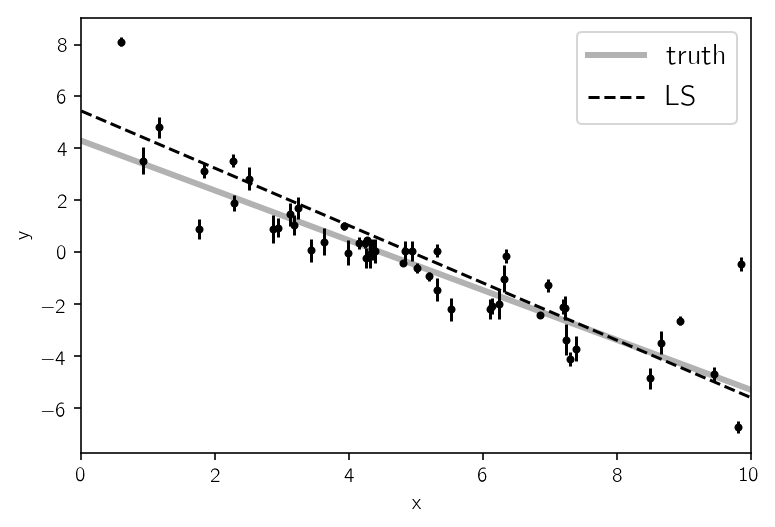
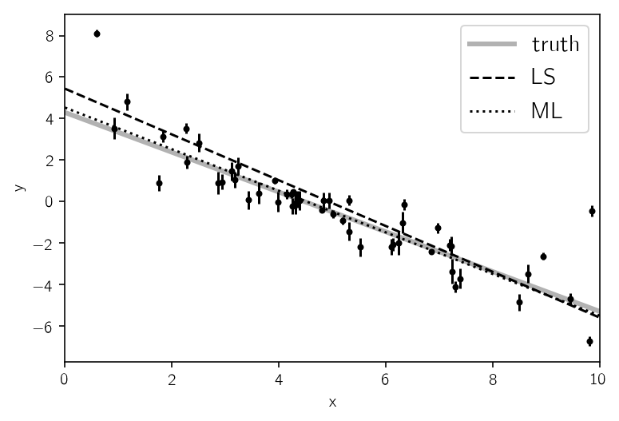
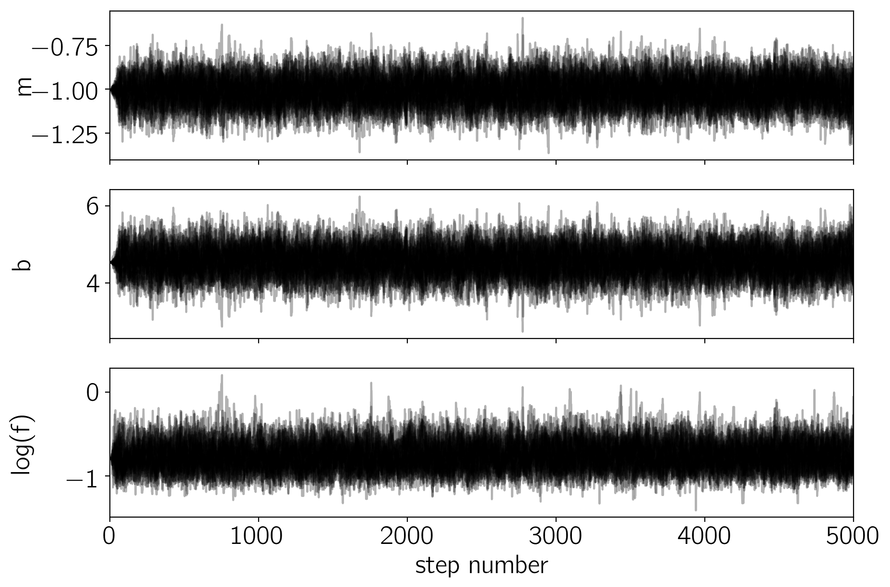
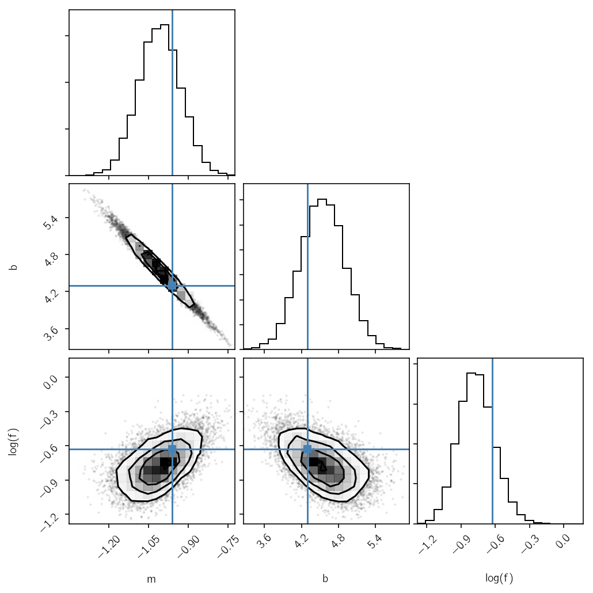
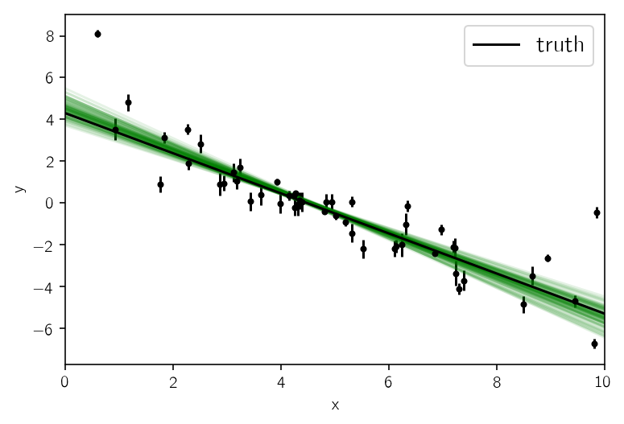

.. module:: emcee

**Note:** This tutorial was generated from an IPython notebook that can be
downloaded `here <../../_static/notebooks/line.ipynb>`_.

.. _line:

Fitting a Model to Data
=======================

If you’re reading this right now then you’re probably interested in
using emcee to fit a model to some noisy data. On this page, I’ll
demonstrate how you might do this in the simplest non-trivial model that
I could think of: fitting a line to data when you don’t believe the
error bars on your data. The interested reader should check out `Hogg,
Bovy & Lang (2010) <http://arxiv.org/abs/1008.4686>`__ for a much more
complete discussion of how to fit a line to data in The Real World™ and
why MCMC might come in handy.

This tutorial was generated with the following version of emcee:

.. code:: python

    import emcee
    print(emcee.__version__)

.. parsed-literal::

    /Users/dforeman/anaconda/lib/python3.6/site-packages/h5py/__init__.py:36: FutureWarning: Conversion of the second argument of issubdtype from `float` to `np.floating` is deprecated. In future, it will be treated as `np.float64 == np.dtype(float).type`.
      from ._conv import register_converters as _register_converters

.. parsed-literal::

    3.0.0.dev0

The generative probabilistic model
----------------------------------

When you approach a new problem, the first step is generally to write
down the *likelihood function* (the probability of a dataset given the
model parameters). This is equivalent to describing the generative
procedure for the data. In this case, we’re going to consider a linear
model where the quoted uncertainties are underestimated by a constant
fractional amount. You can generate a synthetic dataset from this model:

.. code:: python

    import numpy as np
    import matplotlib.pyplot as plt
    np.random.seed(123)
    
    # Choose the "true" parameters.
    m_true = -0.9594
    b_true = 4.294
    f_true = 0.534
    
    # Generate some synthetic data from the model.
    N = 50
    x = np.sort(10*np.random.rand(N))
    yerr = 0.1+0.5*np.random.rand(N)
    y = m_true*x+b_true
    y += np.abs(f_true*y) * np.random.randn(N)
    y += yerr * np.random.randn(N)
    
    plt.errorbar(x, y, yerr=yerr, fmt=".k", capsize=0)
    x0 = np.linspace(0, 10, 500)
    plt.plot(x0, m_true*x0+b_true, "k", alpha=0.3, lw=3)
    plt.xlim(0, 10)
    plt.xlabel("x")
    plt.ylabel("y");

The true model is shown as the thick grey line and the effect of the
underestimated uncertainties is obvious when you look at this figure.
The standard way to fit a line to these data (assuming independent
Gaussian error bars) is linear least squares. Linear least squares is
appealing because solving for the parameters—and their associated
uncertainties—is simply a linear algebraic operation. Following the
notation in `Hogg, Bovy & Lang
(2010) <http://arxiv.org/abs/1008.4686>`__, the linear least squares
solution to these data is

.. code:: python

    A = np.vander(x, 2)
    C = np.diag(yerr * yerr)
    ATA = np.dot(A.T, A / (yerr**2)[:, None])
    cov = np.linalg.inv(ATA)
    w = np.linalg.solve(ATA, np.dot(A.T, y / yerr**2))
    print("Least-squares estimates:")
    print("m = {0:.3f} ± {1:.3f}".format(w[0], np.sqrt(cov[0, 0])))
    print("b = {0:.3f} ± {1:.3f}".format(w[1], np.sqrt(cov[1, 1])))
    
    plt.errorbar(x, y, yerr=yerr, fmt=".k", capsize=0)
    plt.plot(x0, m_true*x0+b_true, "k", alpha=0.3, lw=3, label="truth")
    plt.plot(x0, np.dot(np.vander(x0, 2), w), "--k", label="LS")
    plt.legend(fontsize=14)
    plt.xlim(0, 10)
    plt.xlabel("x")
    plt.ylabel("y");

.. parsed-literal::

    Least-squares estimates:
    m = -1.104 ± 0.016
    b = 5.441 ± 0.091

This figure shows the least-squares estimate of the line parameters as a
dashed line. This isn’t an unreasonable result but the uncertainties on
the slope and intercept seem a little small (because of the small error
bars on most of the data points).

Maximum likelihood estimation
-----------------------------

The least squares solution found in the previous section is the maximum
likelihood result for a model where the error bars are assumed correct,
Gaussian and independent. We know, of course, that this isn’t the right
model. Unfortunately, there isn’t a generalization of least squares that
supports a model like the one that we know to be true. Instead, we need
to write down the likelihood function and numerically optimize it. In
mathematical notation, the correct likelihood function is:

.. math::

       \ln\,p(y\,|\,x,\sigma,m,b,f) =
       -\frac{1}{2} \sum_n \left[
           \frac{(y_n-m\,x_n-b)^2}{s_n^2}
           + \ln \left ( 2\pi\,s_n^2 \right )
       \right]

where

.. math::

       s_n^2 = \sigma_n^2+f^2\,(m\,x_n+b)^2 \quad .

This likelihood function is simply a Gaussian where the variance is
underestimated by some fractional amount: :math:`f`. In Python, you
would code this up as:

.. code:: python

    def log_likelihood(theta, x, y, yerr):
        m, b, log_f = theta
        model = m * x + b
        sigma2 = yerr**2 + model**2*np.exp(2*log_f)
        return -0.5*np.sum((y-model)**2/sigma2 + np.log(sigma2))

In this code snippet, you’ll notice that we’re using the logarithm of
:math:`f` instead of :math:`f` itself for reasons that will become clear
in the next section. For now, it should at least be clear that this
isn’t a bad idea because it will force :math:`f` to be always positive.
A good way of finding this numerical optimum of this likelihood function
is to use the
`scipy.optimize <http://docs.scipy.org/doc/scipy/reference/optimize.html>`__
module:

.. code:: python

    from scipy.optimize import minimize
    np.random.seed(42)
    nll = lambda *args: -log_likelihood(*args)
    initial = np.array([m_true, b_true, np.log(f_true)]) + 0.1*np.random.randn(3)
    soln = minimize(nll, initial, args=(x, y, yerr))
    m_ml, b_ml, log_f_ml = soln.x
    
    print("Maximum likelihood estimates:")
    print("m = {0:.3f}".format(m_ml))
    print("b = {0:.3f}".format(b_ml))
    print("f = {0:.3f}".format(np.exp(log_f_ml)))
    
    plt.errorbar(x, y, yerr=yerr, fmt=".k", capsize=0)
    plt.plot(x0, m_true*x0+b_true, "k", alpha=0.3, lw=3, label="truth")
    plt.plot(x0, np.dot(np.vander(x0, 2), w), "--k", label="LS")
    plt.plot(x0, np.dot(np.vander(x0, 2), [m_ml, b_ml]), ":k", label="ML")
    plt.legend(fontsize=14)
    plt.xlim(0, 10)
    plt.xlabel("x")
    plt.ylabel("y");

.. parsed-literal::

    Maximum likelihood estimates:
    m = -1.003
    b = 4.528
    f = 0.454

It’s worth noting that the optimize module *minimizes* functions whereas
we would like to maximize the likelihood. This goal is equivalent to
minimizing the *negative* likelihood (or in this case, the negative
*log* likelihood). In this figure, the maximum likelihood (ML) result is
plotted as a dotted black line—compared to the true model (grey line)
and linear least-squares (LS; dashed line). That looks better!

The problem now: how do we estimate the uncertainties on *m* and *b*?
What’s more, we probably don’t really care too much about the value of
*f* but it seems worthwhile to propagate any uncertainties about its
value to our final estimates of *m* and *b*. This is where MCMC comes
in.

Marginalization & uncertainty estimation
----------------------------------------

This isn’t the place to get into the details of why you might want to
use MCMC in your research but it is worth commenting that a common
reason is that you would like to marginalize over some “nuisance
parameters” and find an estimate of the posterior probability function
(the distribution of parameters that is consistent with your dataset)
for others. MCMC lets you do both of these things in one fell swoop! You
need to start by writing down the posterior probability function (up to
a constant):

.. math::

       p (m,b,f\,|\,x,y,\sigma) \propto p(m,b,f)\,p(y\,|\,x,\sigma,m,b,f) \quad .

We have already, in the previous section, written down the likelihood
function

.. math::

   p(y\,|\,x,\sigma,m,b,f)

so the missing component is the “prior” function

.. math::

   p(m,b,f) \quad .

This function encodes any previous knowledge that we have about the
parameters: results from other experiments, physically acceptable
ranges, etc. It is necessary that you write down priors if you’re going
to use MCMC because all that MCMC does is draw samples from a
probability distribution and you want that to be a probability
distribution for your parameters. This is important: **you cannot draw
parameter samples from your likelihood function**. This is because a
likelihood function is a probability distribution **over datasets** so,
conditioned on model parameters, you can draw representative datasets
(as demonstrated at the beginning of this exercise) but you cannot draw
parameter samples.

In this example, we’ll use uniform (so-called “uninformative”) priors on
:math:`m`, :math:`b` and the logarithm of :math:`f`. For example, we’ll
use the following conservative prior on :math:`m`:

.. math::

   p(m) = \left \{\begin{array}{ll}
           1 / 5.5 \,, & \mbox{if}\,-5 < m < 1/2 \\
           0 \,, & \mbox{otherwise}
       \end{array}
       \right .

In code, the log-prior is (up to a constant):

.. code:: python

    def log_prior(theta):
        m, b, log_f = theta
        if -5.0 < m < 0.5 and 0.0 < b < 10.0 and -10.0 < log_f < 1.0:
            return 0.0
        return -np.inf

Then, combining this with the definition of ``log_likelihood`` from
above, the full log-probability function is:

.. code:: python

    def log_probability(theta, x, y, yerr):
        lp = log_prior(theta)
        if not np.isfinite(lp):
            return -np.inf
        return lp + log_likelihood(theta, x, y, yerr)

After all this setup, it’s easy to sample this distribution using emcee.
We’ll start by initializing the walkers in a tiny Gaussian ball around
the maximum likelihood result (I’ve found that this tends to be a pretty
good initialization in most cases) and then run 5,000 steps of MCMC.

.. code:: python

    pos = soln.x + 1e-4*np.random.randn(32, 3)
    nwalkers, ndim = pos.shape
    
    sampler = emcee.EnsembleSampler(nwalkers, ndim, log_probability, args=(x, y, yerr))
    sampler.run_mcmc(pos, 5000, progress=True);

.. parsed-literal::

    100%|██████████| 5000/5000 [00:07<00:00, 688.00it/s]

Let’s take a look at what the sampler has done. A good first step is to
look at the time series of the parameters in the chain. The samples can
be accessed using the :func:`EnsembleSampler.get_chain` method. This
will return an array with the shape ``(5000, 32, 3)`` giving the
parameter values for each walker at each step in the chain. The figure
below shows the positions of each walker as a function of the number of
steps in the chain:

.. code:: python

    fig, axes = plt.subplots(3, figsize=(10, 7), sharex=True)
    samples = sampler.get_chain()
    labels = ["m", "b", "log(f)"]
    for i in range(ndim):
        ax = axes[i]
        ax.plot(samples[:, :, i], "k", alpha=0.3)
        ax.set_xlim(0, len(samples))
        ax.set_ylabel(labels[i])
        ax.yaxis.set_label_coords(-0.1, 0.5)
    
    axes[-1].set_xlabel("step number");

As mentioned above, the walkers start in small distributions around the
maximum likelihood values and then they quickly wander and start
exploring the full posterior distribution. In fact, after fewer than 50
steps, the samples seem pretty well “burnt-in”. That is a hard statement
to make quantitatively, but we can look at an estimate of the integrated
autocorrelation time (see the :ref:`autocorr` tutorial for more
details):

.. code:: python

    tau = sampler.get_autocorr_time()
    print(tau)

.. parsed-literal::

    [39.99526726 39.76501919 41.02623912]

This suggests that only about 40 steps are needed for the chain to
“forget” where it started. It’s not unreasonable to throw away a few
times this number of steps as “burn-in”. Let’s discard the initial 100
steps, thin by about half the autocorrelation time (15 steps), and
flatten the chain so that we have a flat list of samples:

.. code:: python

    flat_samples = sampler.get_chain(discard=100, thin=15, flat=True)
    print(flat_samples.shape)

.. parsed-literal::

    (10432, 3)

Results
-------

Now that we have this list of samples, let’s make one of the most useful
plots you can make with your MCMC results: *a corner plot*. You’ll need
the `corner.py module <http://corner.readthedocs.io>`__ but once you
have it, generating a corner plot is as simple as:

.. code:: python

    import corner
    fig = corner.corner(flat_samples, labels=labels, truths=[m_true, b_true, np.log(f_true)]);

The corner plot shows all the one and two dimensional projections of the
posterior probability distributions of your parameters. This is useful
because it quickly demonstrates all of the covariances between
parameters. Also, the way that you find the marginalized distribution
for a parameter or set of parameters using the results of the MCMC chain
is to project the samples into that plane and then make an N-dimensional
histogram. That means that the corner plot shows the marginalized
distribution for each parameter independently in the histograms along
the diagonal and then the marginalized two dimensional distributions in
the other panels.

Another diagnostic plot is the projection of your results into the space
of the observed data. To do this, you can choose a few (say 100 in this
case) samples from the chain and plot them on top of the data points:

.. code:: python

    inds = np.random.randint(len(flat_samples), size=100)
    for ind in inds:
        sample = flat_samples[ind]
        plt.plot(x0, np.dot(np.vander(x0, 2), sample[:2]), "g", alpha=0.1)
    plt.errorbar(x, y, yerr=yerr, fmt=".k", capsize=0)
    plt.plot(x0, m_true*x0+b_true, "k", label="truth")
    plt.legend(fontsize=14)
    plt.xlim(0, 10)
    plt.xlabel("x")
    plt.ylabel("y");

This leaves us with one question: which numbers should go in the
abstract? There are a few different options for this but my favorite is
to quote the uncertainties based on the 16th, 50th, and 84th percentiles
of the samples in the marginalized distributions. To compute these
numbers for this example, you would run:

.. code:: python

    from IPython.display import display, Math
    
    for i in range(ndim):
        mcmc = np.percentile(flat_samples[:, i], [16, 50, 84])
        q = np.diff(mcmc)
        txt = "\mathrm{{{3}}} = {0:.3f}_{{-{1:.3f}}}^{{{2:.3f}}}"
        txt = txt.format(mcmc[1], q[0], q[1], labels[i])
        display(Math(txt))

.. math::

    \mathrm{m} = -1.007_{-0.078}^{0.080}

.. math::

    \mathrm{b} = 4.544_{-0.357}^{0.359}

.. math::

    \mathrm{log(f)} = -0.771_{-0.151}^{0.162}

