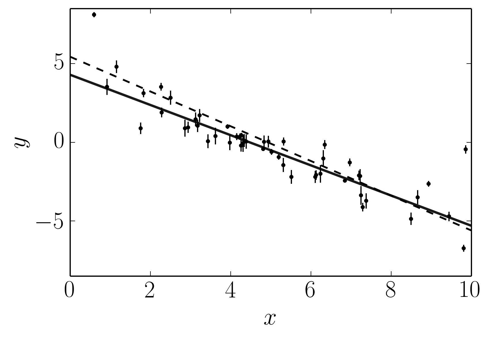
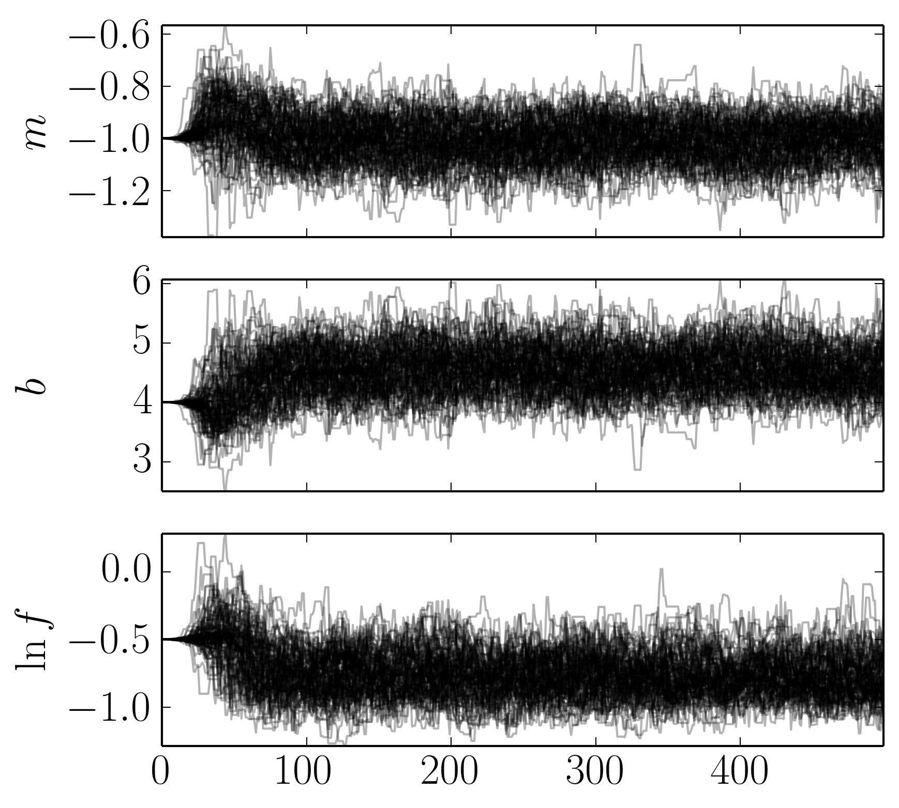
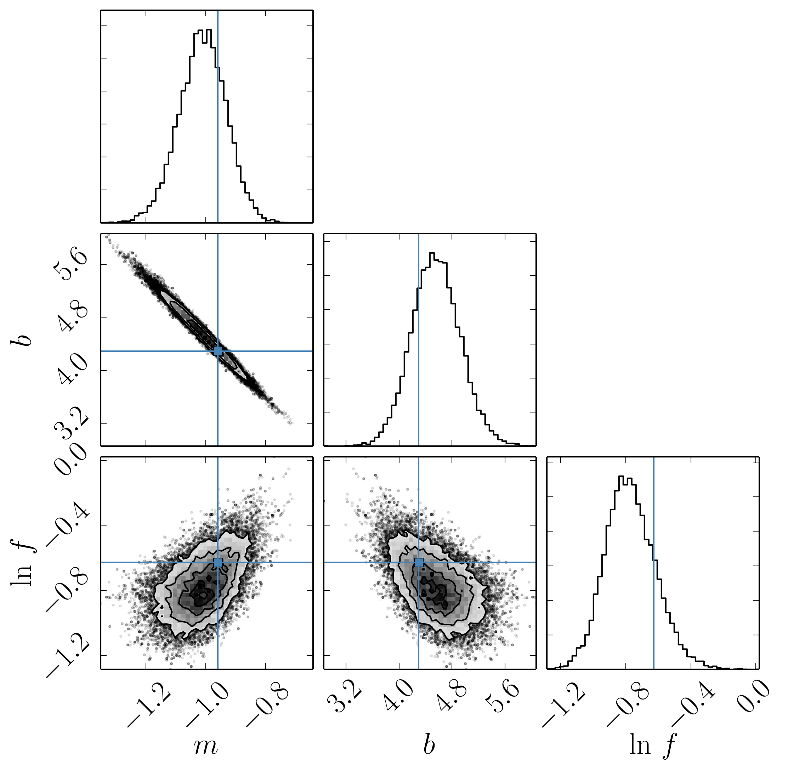
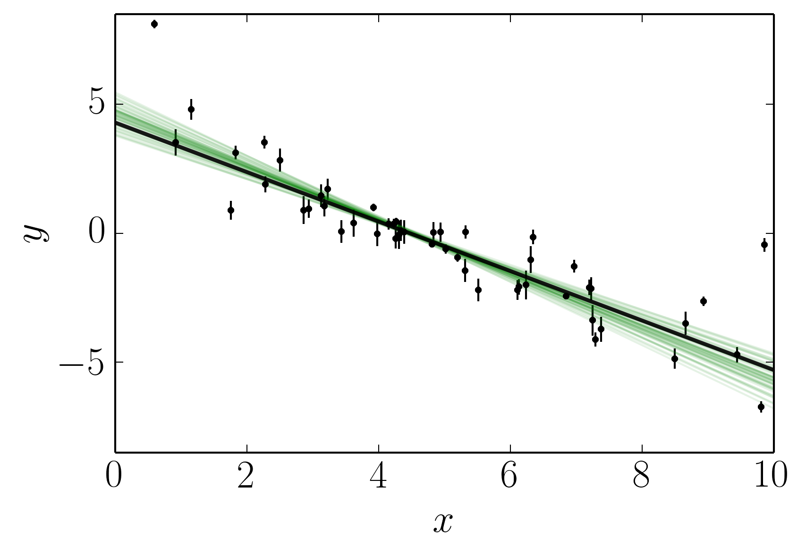

Tutorial: Fitting a Model to Data
=================================

If you’re reading this right now then you’re probably interested in
using emcee to fit a model to some noisy data. On this page, I’ll
demonstrate how you might do this in the simplest non-trivial model that
I could think of: fitting a line to data when you don’t believe the
error bars on your data. The interested reader should check out `Hogg,
Bovy & Lang (2010) <http://arxiv.org/abs/1008.4686>`__ for a much more
complete discussion of how to fit a line to data in The Real World™ and
why MCMC might come in handy.

The full source code for this example is available in the GitHub
repository.

The generative probabilistic model
----------------------------------

When you approach a new problem, the first step is generally to write
down the likelihood function (the probability of a dataset given the
model parameters). This is equivalent to describing the generative
procedure for the data. In this case, we’re going to consider a linear
model where the quoted uncertainties are underestimated by a constant
fractional amount. You can generate a synthetic dataset from this model:

.. code:: python

    import numpy as np
    np.random.seed(123)
    
    # Choose the "true" parameters.
    m_true = -0.9594
    b_true = 4.294
    f_true = 0.534
    
    # Generate some synthetic data from the model.
    N = 50
    x = np.sort(10*np.random.rand(N))
    yerr = 0.1+0.5*np.random.rand(N)
    y = m_true*x+b_true
    y += np.abs(f_true*y) * np.random.randn(N)
    y += yerr * np.random.randn(N)
This synthetic dataset (with the underestimated error bars) will look
something like:

.. code:: python

    import matplotlib.pyplot as pl
    
    x0 = np.linspace(0, 10, 2)
    def plot_data():
        pl.errorbar(x, y, yerr=yerr, fmt=".k", capsize=0)
        pl.plot(x0, m_true * x0 + b_true, "k", lw=2, alpha=0.9)
        pl.ylim(-8.5, 8.5)
        pl.xlabel("$x$")
        pl.ylabel("$y$");
        
    plot_data()

.. image:: line_files/line_3_0.png

The true model is shown as the thick grey line and the effect of the
underestimated uncertainties is obvious when you look at this figure.
The standard way to fit a line to these data (assuming independent
Gaussian error bars) is linear least squares. Linear least squares is
appealing because solving for the parameters—and their associated
uncertainties—is simply a linear algebraic operation. Following the
notation in `Hogg, Bovy & Lang
(2010) <http://arxiv.org/abs/1008.4686>`__, the linear least squares
solution to these data is:

.. code:: python

    A = np.vstack((np.ones_like(x), x)).T
    ivar = 1.0 / yerr**2
    cov = np.linalg.inv(np.dot(A.T, ivar[:, None] * A))
    b_ls, m_ls = np.dot(cov, np.dot(A.T, ivar * y))
.. code:: python

    from IPython.display import display, Math
    display(Math(r"m_\mathrm{{LS}} = {0:.2f} \pm {1:.2f}".format(m_ls, np.sqrt(cov[1, 1]))))
    display(Math(r"b_\mathrm{{LS}} = {0:.2f} \pm {1:.2f}".format(b_ls, np.sqrt(cov[0, 0]))))

.. math::

    m_\mathrm{LS} = -1.10 \pm 0.02

.. math::

    b_\mathrm{LS} = 5.44 \pm 0.09

.. code:: python

    plot_data()
    pl.plot(x0, m_ls * x0 + b_ls, "--k", lw=1.5);

This isn’t an unreasonable result but the uncertainties on the slope and
intercept seem a little small (because of the small error bars on most
of the data points).

Building the probabilistic model
--------------------------------

.. math::

   \ln\,p(y\,|\,x,\sigma,m,b,f) =
   -\frac{1}{2} \sum_n \left[
     \frac{(y_n-m\,x_n-b)^2}{s_n^2}
     + \ln \left ( 2\pi\,s_n^2 \right )
   \right]

where

.. math:: s_n^2 = \sigma_n^2+f^2\,(m\,x_n+b)^2 \quad .

.. code:: python

    import emcee
    
    class LinearModel(emcee.BaseWalker):
        
        def lnpriorfn(self, theta):
            m, b, lnf = theta
            if -5.0 < m < 0.5 and 0.0 < b < 10.0 and -10.0 < lnf < 1.0:
                return 0.0
            return -np.inf
    
        def lnlikefn(self, theta):
            m, b, lnf = theta
            model = m * x + b
            inv_sigma2 = 1.0/(yerr**2 + model**2*np.exp(2*lnf))
            return -0.5*(np.sum((y-model)**2*inv_sigma2 - np.log(inv_sigma2)))
.. code:: python

    ndim, nwalkers = 3, 100
    coords = np.array([-1.0, 4.0, -0.5]) + 1e-4*np.random.randn(nwalkers, ndim)
    ensemble = emcee.Ensemble(LinearModel(), coords)
.. code:: python

    sampler = emcee.Sampler()
    sampler.run(ensemble, 500);
.. code:: python

    chain = sampler.get_coords()
    fig, axes = pl.subplots(3, 1, sharex=True, figsize=(6, 6))
    for k, nm in enumerate(["$m$", "$b$", r"$\ln f$"]):
        axes[k].plot(chain[:, :, k], "k", alpha=0.3)
        axes[k].locator_params(tight=True, nbins=6)
        axes[k].yaxis.set_label_coords(-0.15, 0.5)
        axes[k].set_ylabel(nm)

.. code:: python

    import triangle
    flatchain = sampler.get_coords(discard=100, flat=True)
    triangle.corner(flatchain, labels=["$m$", "$b$", "$\ln\,f$"],
                    truths=[m_true, b_true, np.log(f_true)]);

.. code:: python

    for i in np.random.randint(len(flatchain), size=50):
        m, b, _ = flatchain[i]
        pl.plot(x0, m * x0 + b, "g", alpha=0.1)
    plot_data()

.. code:: python

    mu, std = np.mean(flatchain, axis=0), np.std(flatchain, axis=0)
    for i, (nm, truth) in enumerate(zip(("m", "b", "\ln f"),
                                        (m_true, b_true, np.log(f_true)))):
        display(Math(r"{0}_\mathrm{{MCMC}} = {1:.2f} \pm {2:.2f} \quad (\mathrm{{truth:}}\,{3:.2f})"
                     .format(nm, mu[i], std[i], truth)))

.. math::

    m_\mathrm{MCMC} = -1.01 \pm 0.08 \quad (\mathrm{truth:}\,-0.96)

.. math::

    b_\mathrm{MCMC} = 4.56 \pm 0.37 \quad (\mathrm{truth:}\,4.29)

.. math::

    \ln f_\mathrm{MCMC} = -0.77 \pm 0.16 \quad (\mathrm{truth:}\,-0.63)

