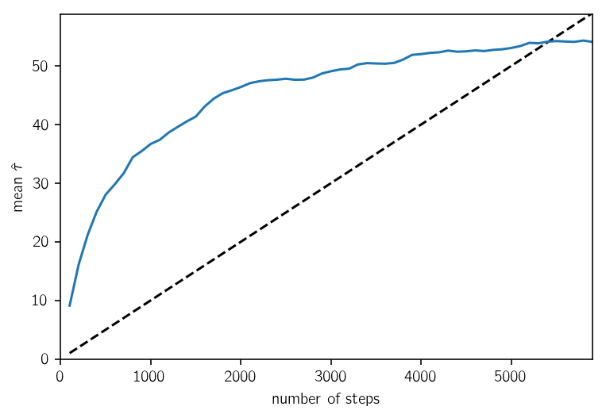
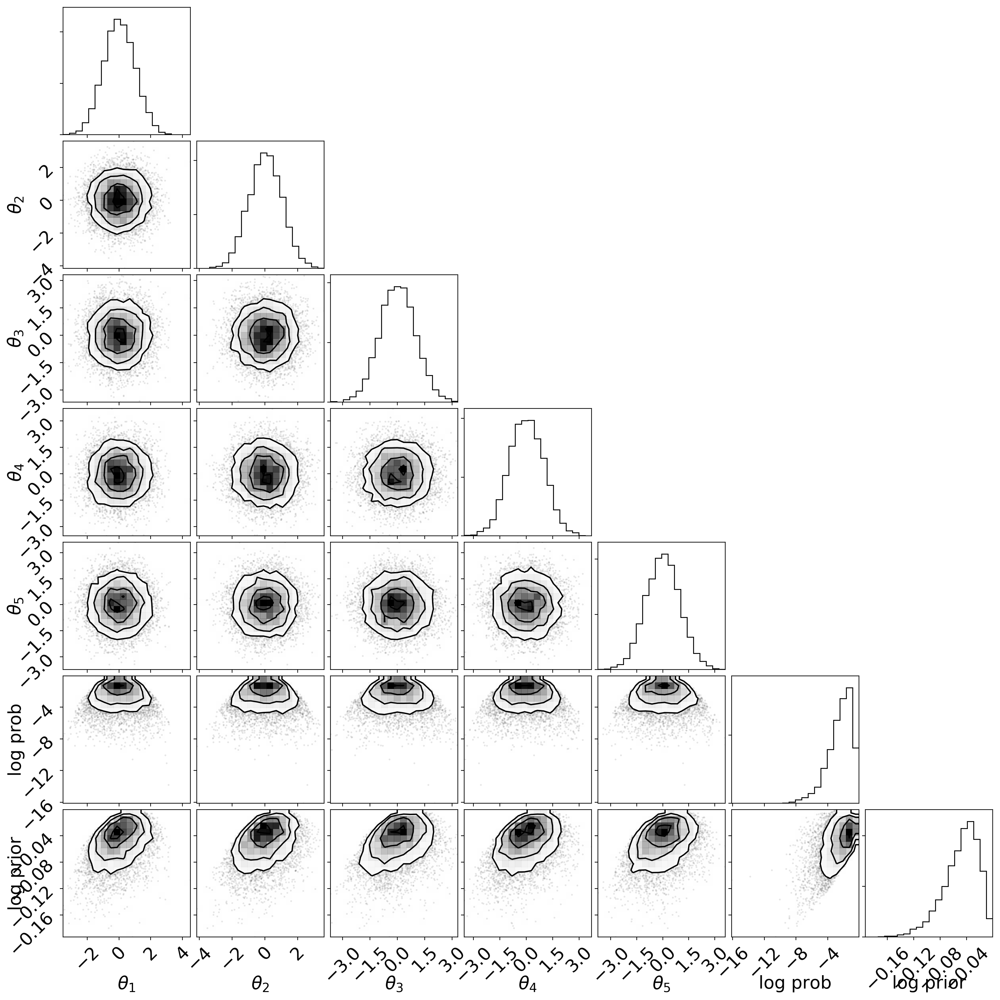

.. module:: emcee

**Note:** This tutorial was generated from an IPython notebook that can be
downloaded `here <../../_static/notebooks/monitor.ipynb>`_.

.. _monitor:

Saving & monitoring progress
============================

It is often useful to incrementally save the state of the chain to a
file. This makes it easier to monitor the chain’s progress and it makes
things a little less disastrous if your code/computer crashes somewhere
in the middle of an expensive MCMC run.

In this demo, we will demonstrate how you can use the new
:class:`backends.HDFBackend` to save your results to a
`HDF5 <https://en.wikipedia.org/wiki/Hierarchical_Data_Format>`__ file
as the chain runs. To execute this, you’ll first need to install the
`h5py library <http://www.h5py.org>`__.

We’ll also monitor the autocorrelation time at regular intervals (see
:ref:`autocorr`) to judge convergence.

.. code:: python

    import emcee
    print(emcee.__version__)

.. parsed-literal::

    /Users/dforeman/anaconda/lib/python3.6/site-packages/h5py/__init__.py:36: FutureWarning: Conversion of the second argument of issubdtype from `float` to `np.floating` is deprecated. In future, it will be treated as `np.float64 == np.dtype(float).type`.
      from ._conv import register_converters as _register_converters

.. parsed-literal::

    3.0.0.dev0

We will set up the problem as usual with one small change:

.. code:: python

    import numpy as np
    np.random.seed(42)
    
    # The definition of the log probability function
    # We'll also use the "blobs" feature to track the "log prior" for each step
    def log_prob(theta):
        log_prior = -0.5 *  np.sum((theta-1.0)**2 / 100.0)
        log_prob = -0.5 * np.sum(theta**2) + log_prior
        return log_prob, log_prior
    
    # Initialize the walkers
    coords = np.random.randn(32, 5)
    nwalkers, ndim = coords.shape
    
    # Set up the backend
    # Don't forget to clear it in case the file already exists
    filename = "tutorial.h5"
    backend = emcee.backends.HDFBackend(filename)
    backend.reset(nwalkers, ndim)
    
    # Initialize the sampler
    sampler = emcee.EnsembleSampler(nwalkers, ndim, log_prob, backend=backend)

The difference here was the addition of a “backend”. This choice will
save the samples to a file called ``tutorial.h5`` in the current
directory. Now, we’ll run the chain for up to 10,000 steps and check the
autocorrelation time every 100 steps. If the chain is longer than 100
times the estimated autocorrelation time and if this estimate changed by
less than 1%, we’ll consider things converged.

.. code:: python

    max_n = 100000
    
    # We'll track how the average autocorrelation time estimate changes
    index = 0
    autocorr = np.empty(max_n)
    
    # This will be useful to testing convergence
    old_tau = np.inf
    
    # Now we'll sample for up to max_n steps
    for sample in sampler.sample(coords, iterations=max_n, progress=True):
        # Only check convergence every 100 steps
        if sampler.iteration % 100:
            continue
            
        # Compute the autocorrelation time so far
        # Using tol=0 means that we'll always get an estimate even
        # if it isn't trustworthy
        tau = sampler.get_autocorr_time(tol=0)
        autocorr[index] = np.mean(tau)
        index += 1
        
        # Check convergence
        converged = np.all(tau * 100 < sampler.iteration)
        converged &= np.all(np.abs(old_tau - tau) / tau < 0.01)
        if converged:
            break
        old_tau = tau

.. parsed-literal::

      6%|▌         | 5900/100000 [01:00<16:01, 97.84it/s]

Now let’s take a look at how the autocorrelation time estimate (averaged
across dimensions) changed over the course of this run. In this plot,
the :math:`\tau` estimate is plotted (in blue) as a function of chain
length and, for comparison, the :math:`N > 100\,\tau` threshold is
plotted as a dashed line.

.. code:: python

    import matplotlib.pyplot as plt
    
    n = 100*np.arange(1, index+1)
    y = autocorr[:index]
    plt.plot(n, n / 100.0, "--k")
    plt.plot(n, y)
    plt.xlim(0, n.max())
    plt.ylim(0, y.max() + 0.1*(y.max() - y.min()))
    plt.xlabel("number of steps")
    plt.ylabel(r"mean $\hat{\tau}$");

As usual, we can also access all the properties of the chain:

.. code:: python

    import corner
    
    tau = sampler.get_autocorr_time()
    burnin = int(2*np.max(tau))
    thin = int(0.5*np.min(tau))
    samples = sampler.get_chain(discard=burnin, flat=True, thin=thin)
    log_prob_samples = sampler.get_log_prob(discard=burnin, flat=True, thin=thin)
    log_prior_samples = sampler.get_blobs(discard=burnin, flat=True, thin=thin)
    
    print("burn-in: {0}".format(burnin))
    print("thin: {0}".format(thin))
    print("flat chain shape: {0}".format(samples.shape))
    print("flat log prob shape: {0}".format(log_prob_samples.shape))
    print("flat log prior shape: {0}".format(log_prior_samples.shape))
    
    all_samples = np.concatenate((
        samples, log_prob_samples[:, None], log_prior_samples[:, None]
    ), axis=1)
    
    labels = list(map(r"$\theta_{{{0}}}$".format, range(1, ndim+1)))
    labels += ["log prob", "log prior"]
    
    corner.corner(all_samples, labels=labels);

.. parsed-literal::

    burn-in: 117
    thin: 24
    flat chain shape: (7680, 5)
    flat log prob shape: (7680,)
    flat log prior shape: (7680,)

But, since you saved your samples to a file, you can also open them
after the fact using the :class:`backends.HDFBackend`:

.. code:: python

    reader = emcee.backends.HDFBackend(filename)
    
    tau = reader.get_autocorr_time()
    burnin = int(2*np.max(tau))
    thin = int(0.5*np.min(tau))
    samples = reader.get_chain(discard=burnin, flat=True, thin=thin)
    log_prob_samples = reader.get_log_prob(discard=burnin, flat=True, thin=thin)
    log_prior_samples = reader.get_blobs(discard=burnin, flat=True, thin=thin)
    
    print("burn-in: {0}".format(burnin))
    print("thin: {0}".format(thin))
    print("flat chain shape: {0}".format(samples.shape))
    print("flat log prob shape: {0}".format(log_prob_samples.shape))
    print("flat log prior shape: {0}".format(log_prior_samples.shape))

.. parsed-literal::

    burn-in: 117
    thin: 24
    flat chain shape: (7680, 5)
    flat log prob shape: (7680,)
    flat log prior shape: (7680,)

This should give the same output as the previous code block, but you’ll
notice that there was no reference to ``sampler`` here at all.

If you want to restart from the last sample, you can just leave out the
call to :func:`backends.HDFBackend.reset`:

.. code:: python

    new_backend = emcee.backends.HDFBackend(filename)
    print("Initial size: {0}".format(new_backend.iteration))
    new_sampler = emcee.EnsembleSampler(nwalkers, ndim, log_prob, backend=new_backend)
    new_sampler.run_mcmc(None, 100)
    print("Final size: {0}".format(new_backend.iteration))

.. parsed-literal::

    Initial size: 5900
    Final size: 6000

