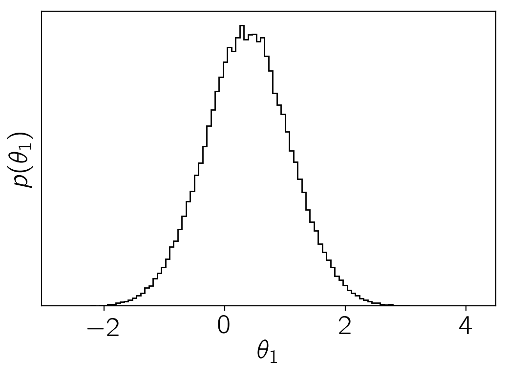

.. module:: emcee

**Note:** This tutorial was generated from an IPython notebook that can be
downloaded `here <../../_static/notebooks/quickstart.ipynb>`_.

.. _quickstart:

Quickstart
==========

This notebook was made with the following version of emcee:

.. code:: python

    import emcee
    emcee.__version__

.. parsed-literal::

    /Users/dforeman/anaconda/lib/python3.6/site-packages/h5py/__init__.py:36: FutureWarning: Conversion of the second argument of issubdtype from `float` to `np.floating` is deprecated. In future, it will be treated as `np.float64 == np.dtype(float).type`.
      from ._conv import register_converters as _register_converters

.. parsed-literal::

    '3.0.0.dev0'

The easiest way to get started with using emcee is to use it for a
project. To get you started, here’s an annotated, fully-functional
example that demonstrates a standard usage pattern.

How to sample a multi-dimensional Gaussian
------------------------------------------

We’re going to demonstrate how you might draw samples from the
multivariate Gaussian density given by:

.. math::

   p(\vec{x}) \propto \exp \left [ - \frac{1}{2} (\vec{x} -
       \vec{\mu})^\mathrm{T} \, \Sigma ^{-1} \, (\vec{x} - \vec{\mu})
       \right ]

where :math:`\vec{\mu}` is an :math:`N`-dimensional vector position of
the mean of the density and :math:`\Sigma` is the square N-by-N
covariance matrix.

The first thing that we need to do is import the necessary modules:

.. code:: python

    import numpy as np

Then, we’ll code up a Python function that returns the density
:math:`p(\vec{x})` for specific values of :math:`\vec{x}`,
:math:`\vec{\mu}` and :math:`\Sigma^{-1}`. In fact, emcee actually
requires the logarithm of :math:`p`. We’ll call it ``log_prob``:

.. code:: python

    def log_prob(x, mu, cov):
        diff = x - mu
        return -0.5*np.dot(diff, np.linalg.solve(cov,diff))

It is important that the first argument of the probability function is
the position of a single “walker” (a *N* dimensional ``numpy`` array).
The following arguments are going to be constant every time the function
is called and the values come from the ``args`` parameter of our
:class:`EnsembleSampler` that we’ll see soon.

Now, we’ll set up the specific values of those “hyperparameters” in 5
dimensions:

.. code:: python

    ndim = 5
    
    np.random.seed(42)
    means = np.random.rand(ndim)
    
    cov = 0.5 - np.random.rand(ndim ** 2).reshape((ndim, ndim))
    cov = np.triu(cov)
    cov += cov.T - np.diag(cov.diagonal())
    cov = np.dot(cov,cov)

and where ``cov`` is :math:`\Sigma`.

How about we use 32 walkers? Before we go on, we need to guess a
starting point for each of the 32 walkers. This position will be a
5-dimensional vector so the initial guess should be a 32-by-5 array.
It’s not a very good guess but we’ll just guess a random number between
0 and 1 for each component:

.. code:: python

    nwalkers = 32
    p0 = np.random.rand(nwalkers, ndim)

Now that we’ve gotten past all the bookkeeping stuff, we can move on to
the fun stuff. The main interface provided by ``emcee`` is the
:class:`EnsembleSampler` object so let’s get ourselves one of those:

.. code:: python

    sampler = emcee.EnsembleSampler(nwalkers, ndim, log_prob, args=[means, cov])

Remember how our function ``log_prob`` required two extra arguments when
it was called? By setting up our sampler with the ``args`` argument,
we’re saying that the probability function should be called as:

.. code:: python

    log_prob(p0[0], means, cov)

.. parsed-literal::

    -2.5960945890854434

If we didn’t provide any ``args`` parameter, the calling sequence would
be ``log_prob(p0[0])`` instead.

It’s generally a good idea to run a few “burn-in” steps in your MCMC
chain to let the walkers explore the parameter space a bit and get
settled into the maximum of the density. We’ll run a burn-in of 100
steps (yep, I just made that number up… it’s hard to really know how
many steps of burn-in you’ll need before you start) starting from our
initial guess ``p0``:

.. code:: python

    state, _ = sampler.run_mcmc(p0, 100)
    sampler.reset()

You’ll notice that I saved the final position of the walkers (after the
100 steps) to a variable called ``pos``. You can check out what will be
contained in the other output variables by looking at the documentation
for the :func:`EnsembleSampler.run_mcmc` function. The call to the
:func:`EnsembleSampler.reset` method clears all of the important
bookkeeping parameters in the sampler so that we get a fresh start. It
also clears the current positions of the walkers so it’s a good thing
that we saved them first.

Now, we can do our production run of 10000 steps:

.. code:: python

    sampler.run_mcmc(state, 10000);

The samples can be accessed using the
:func:`EnsembleSampler.get_chain` method. This will return an array
with the shape ``(10000, 32, 5)`` giving the parameter values for each
walker at each step in the chain. Take note of that shape and make sure
that you know where each of those numbers come from. You can make
histograms of these samples to get an estimate of the density that you
were sampling:

.. code:: python

    import matplotlib.pyplot as plt
    
    samples = sampler.get_chain(flat=True)
    plt.hist(samples[:, 0], 100, color="k", histtype="step")
    plt.xlabel(r"$\theta_1$")
    plt.ylabel(r"$p(\theta_1)$")
    plt.gca().set_yticks([]);

Another good test of whether or not the sampling went well is to check
the mean acceptance fraction of the ensemble using the
:func:`EnsembleSampler.acceptance_fraction` property:

.. code:: python

    print("Mean acceptance fraction: {0:.3f}"
          .format(np.mean(sampler.acceptance_fraction)))

.. parsed-literal::

    Mean acceptance fraction: 0.552

and the integrated autocorrelation time (see the :ref:`autocorr`
tutorial for more details)

.. code:: python

    print("Mean autocorrelation time: {0:.3f} steps"
          .format(np.mean(sampler.get_autocorr_time())))

.. parsed-literal::

    Mean autocorrelation time: 57.112 steps

