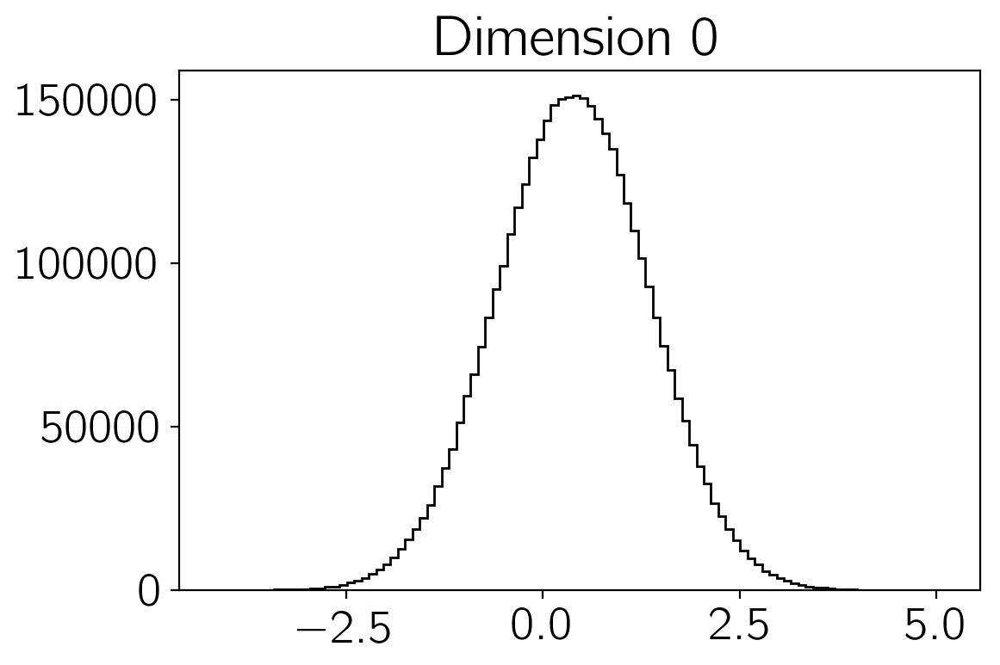
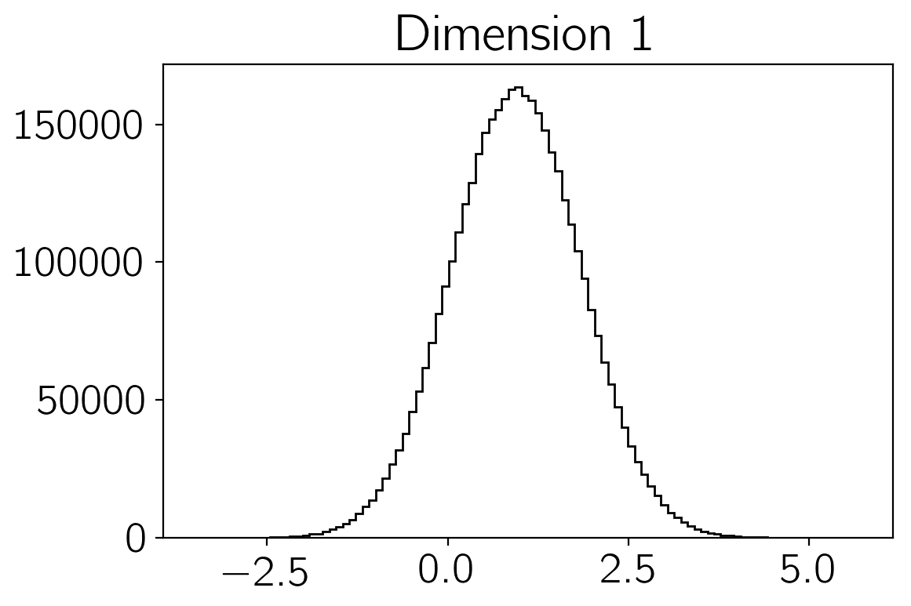
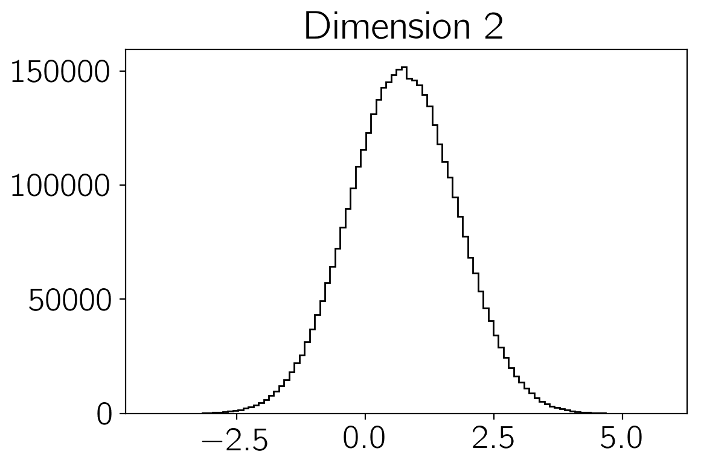
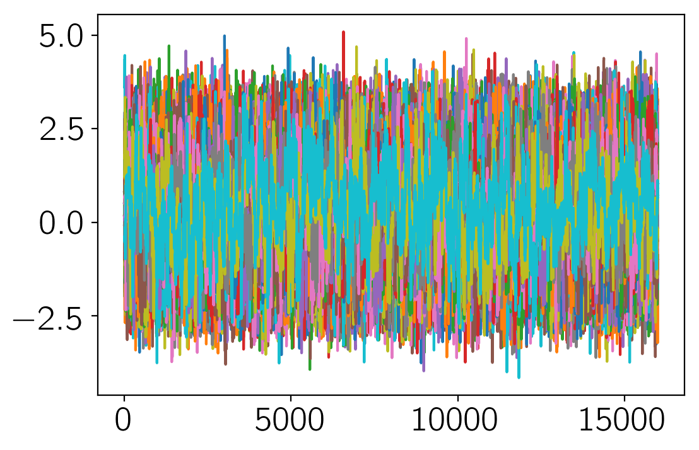
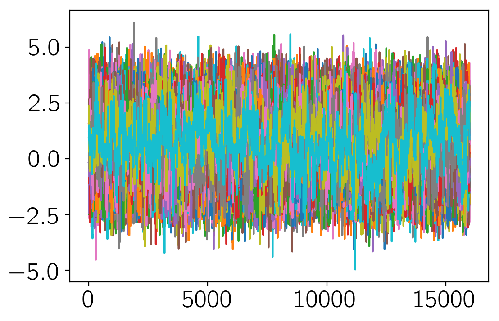

.. module:: george

**Note:** This tutorial was generated from an IPython notebook that can be
downloaded `here <../../_static/notebooks/quickstart.ipynb>`_.

.. _quickstart:

Quickstart
==========

This notebook was made with the following version of emcee:

.. code:: python

    import emcee
    emcee.__version__

.. parsed-literal::

    '3.0.0.dev0'

The easiest way to get started with using emcee is to use it for a
project. To get you started, here’s an annotated, fully-functional
example that demonstrates a standard usage pattern.

How to sample a multi-dimensional Gaussian
------------------------------------------

We’re going to demonstrate how you might draw samples from the
multivariate Gaussian density given by:

.. math::

   p(\vec{x}) \propto \exp \left [ - \frac{1}{2} (\vec{x} -
       \vec{\mu})^\mathrm{T} \, \Sigma ^{-1} \, (\vec{x} - \vec{\mu})
       \right ]

where :math:`\vec{\mu}` is an :math:`N`-dimensional vector position of
the mean of the density and :math:`\Sigma` is the square N-by-N
covariance matrix.

The first thing that we need to do is import the necessary modules:

.. code:: python

    import numpy as np
    import emcee

Then, we’ll code up a Python function that returns the density
:math:`p(\vec{x})` for specific values of :math:`\vec{x}`,
:math:`\vec{\mu}` and :math:`\Sigma^{-1}`. In fact, emcee actually
requires the logarithm of :math:`p`. We’ll call it ``log_prob``:

.. code:: python

    def log_prob(x, mu, icov):
        diff = x - mu
        return -0.5*np.dot(diff,np.dot(icov,diff))

It is important that the first argument of the probability function is
the position of a single "walker" (a *N* dimensional ``numpy`` array).
The following arguments are going to be constant every time the function
is called and the values come from the ``args`` parameter of our
:class:``EnsembleSampler`` that we'll see soon.

Now, we'll set up the specific values of those "hyperparameters" in 10
dimensions:

.. code:: python

    ndim = 10
    
    np.random.seed(42)
    means = np.random.rand(ndim)
    
    cov = 0.5 - np.random.rand(ndim ** 2).reshape((ndim, ndim))
    cov = np.triu(cov)
    cov += cov.T - np.diag(cov.diagonal())
    cov = np.dot(cov,cov)

and where ``cov`` is :math:`\Sigma`. Before going on, let's compute the
inverse of ``cov`` because that's what we need in our probability
function:

.. code:: python

    icov = np.linalg.inv(cov)

It's probably overkill this time but how about we use 250 walkers?
Before we go on, we need to guess a starting point for each of the 250
walkers. This position will be a 50-dimensional vector so the initial
guess should be a 250-by-50 array—or a list of 250 arrays that each have
50 elements. It's not a very good guess but we'll just guess a random
number between 0 and 1 for each component:

.. code:: python

    nwalkers = 250
    p0 = np.random.rand(nwalkers, ndim)

Now that we've gotten past all the bookkeeping stuff, we can move on to
the fun stuff. The main interface provided by ``emcee`` is the
:class:``EnsembleSampler`` object so let's get ourselves one of those:

.. code:: python

    sampler = emcee.EnsembleSampler(nwalkers, ndim, log_prob, args=[means, icov])

Remember how our function ``log_prob`` required two extra arguments when
it was called? By setting up our sampler with the ``args`` argument,
we're saying that the probability function should be called as:

.. code:: python

    log_prob(p0[0], means, icov)

.. parsed-literal::

    -4.5205477379669485

If we didn't provide any ``args`` parameter, the calling sequence would
be ``log_prob(p0[0])`` instead.

It's generally a good idea to run a few "burn-in" steps in your MCMC
chain to let the walkers explore the parameter space a bit and get
settled into the maximum of the density. We'll run a burn-in of 100
steps (yep, I just made that number up... it's hard to really know how
many steps of burn-in you'll need before you start) starting from our
initial guess ``p0``:

.. code:: python

    pos, prob, state = sampler.run_mcmc(p0, 100)
    sampler.reset()

You'll notice that I saved the final position of the walkers (after the
100 steps) to a variable called ``pos``. You can check out what will be
contained in the other output variables by looking at the documentation
for the :func:``EnsembleSampler.run_mcmc`` function. The call to the
:func:``EnsembleSampler.reset`` method clears all of the important
bookkeeping parameters in the sampler so that we get a fresh start. It
also clears the current positions of the walkers so it's a good thing
that we saved them first.

Now, we can do our production run of 10000 steps:

.. code:: python

    sampler.run_mcmc(pos, 10000);

The sampler now has a property :attr:``EnsembleSampler.chain`` that is a
numpy array with the shape ``(1000, 250, 50)``. Take note of that shape
and make sure that you know where each of those numbers come from.
Another useful object is the :attr:``EnsembleSampler.flatchain`` which
has the shape ``(250000, 50)`` and contains all the samples reshaped
into a flat list. You can see now that we now have 250 000 unbiased
samples of the density :math:`p(\vec{x})`. You can make histograms of
these samples to get an estimate of the density that you were sampling:

.. code:: python

    import matplotlib.pyplot as plt
    
    for i in range(3):
        plt.figure()
        plt.hist(sampler.flatchain[:,i], 100, color="k", histtype="step")
        plt.title("Dimension {0:d}".format(i))

Another good test of whether or not the sampling went well is to check
the mean acceptance fraction of the ensemble using the
:func:``EnsembleSampler.acceptance_fraction`` property:

.. code:: python

    print("Mean acceptance fraction: {0:.3f}"
          .format(np.mean(sampler.acceptance_fraction)))

.. parsed-literal::

    Mean acceptance fraction: 0.418

This number should be between approximately 0.25 and 0.5 if everything
went as planned.

.. code:: python

    plt.plot(sampler.chain[:, :, 0]);

.. code:: python

    plt.plot(sampler.chain[:, :, -1]);

.. code:: python

    from emcee.autocorr import function, AutocorrError
    
    def integrated_time(x, low=10, high=None, step=1, c=10, full_output=False,
                        axis=0, fast=False, quiet=False):
        """Estimate the integrated autocorrelation time of a time series.
        This estimate uses the iterative procedure described on page 16 of `Sokal's
        notes <http://www.stat.unc.edu/faculty/cji/Sokal.pdf>`_ to determine a
        reasonable window size.
        Args:
            x: The time series. If multidimensional, set the time axis using the
                ``axis`` keyword argument and the function will be computed for
                every other axis.
            low (Optional[int]): The minimum window size to test. (default: ``10``)
            high (Optional[int]): The maximum window size to test. (default:
                ``x.shape[axis] / 2``)
            step (Optional[int]): The step size for the window search. (default:
                ``1``)
            c (Optional[float]): The minimum number of autocorrelation times
                needed to trust the estimate. (default: ``10``)
            full_output (Optional[bool]): Return the final window size as well as
                the autocorrelation time. (default: ``False``)
            axis (Optional[int]): The time axis of ``x``. Assumed to be the first
                axis if not specified.
            fast (Optional[bool]): (depricated) ignored; the algorithm
                always pads to the nearest power of two.
        Returns:
            float or array: An estimate of the integrated autocorrelation time of
                the time series ``x`` computed along the axis ``axis``.
            Optional[int]: The final window size that was used. Only returned if
                ``full_output`` is ``True``.
        Raises
            AutocorrError: If the autocorrelation time can't be reliably estimated
                from the chain. This normally means that the chain is too short.
        """
        size = 0.5 * x.shape[axis]
        if int(c * low) >= size:
            if quiet:
                logging.warn("The chain is too short")
                return
            raise AutocorrError("The chain is too short")
    
        # Compute the autocorrelation function.
        f = function(x, axis=axis, fast=fast)
    
        # Check the dimensions of the array.
        oned = len(f.shape) == 1
        m = [slice(None), ] * len(f.shape)
    
        # Loop over proposed window sizes until convergence is reached.
        if high is None:
            high = int(size / c)
        print(high)
    
        if oned:
            acl_ests = 2.0*np.cumsum(f) - 1.0
        else:
            acl_ests = 2.0*np.cumsum(f, axis=axis) - 1.0
    
        for M in np.arange(low, high, step).astype(int):
            # Compute the autocorrelation time with the given window.
            if oned:
                # Special case 1D for simplicity.
                tau = acl_ests[M]
            else:
                # N-dimensional case.
                m[axis] = M
                tau = acl_ests[m]
    
            # Accept the window size if it satisfies the convergence criterion.
            if np.all(tau > 1.0) and M > c * tau.max():
                if full_output:
                    return tau, M
                return tau
    
        msg = ("The chain is too short to reliably estimate the autocorrelation "
               "time.")
        if tau is not None:
            msg += " Current estimate: \n{0}".format(tau)
        if quiet:
            logging.warn(msg)
            return None
        raise AutocorrError(msg)

